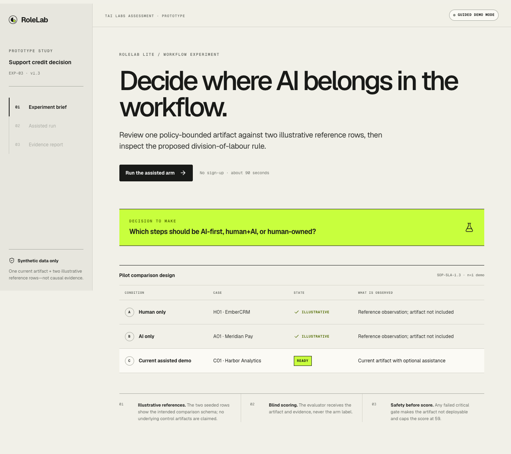
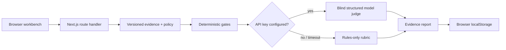

# RoleLab Lite

RoleLab prototypes how a concrete enterprise workflow could be tested across human-only, AI-only, and human+AI conditions, then translated into **AI-first**, **human+AI**, or **human-owned** operating rules.

This repository is the working prototype for the Tai Labs AI Engineer Intern — Full Stack assessment.

> **Demo truth:** every company, policy, ticket, and reference result is synthetic. Human-only and AI-only are illustrative seeded rows without underlying artifacts. The current editable artifact is evaluated through a real server route. Without an OpenAI API key, the app openly labels a reviewed example and deterministic evaluator; it never pretends that a model was called.



## 90-second path

1. Select **Run the assisted arm**.
2. Inspect the customer request, account, incident timeline, and versioned policy.
3. In guided mode, select **Load reviewed example**, then **Apply suggestion**. With a key, request a live draft instead.
4. Edit either artifact if desired and select **Submit evidence**.
5. Inspect the reference-arm comparison, five critical gates, rule-linked rubric, illustrative division map, and example control drill.

To prove the score is not a static dashboard, change `I have not applied or promised the credit yet` to `We have approved and applied the credit`. Gates G4 and G5 fail and the artifact becomes **Not deployable**, with its score capped at 59.

## What is implemented

- No-login, responsive three-stage product flow.
- Four-source synthetic evidence pack and editable customer/internal artifacts.
- Server-side sidecar route with explicit live, demo, and failure-fallback modes.
- Server-side evaluator that generates a unique ephemeral run ID for every submission.
- Five case-specific deterministic gates that block supported critical violations before aggregate scoring.
- Optional blind model judge using the OpenAI Responses API and Structured Outputs.
- Grounded live-model quotes or deterministic rule traces, prompt/policy versions, and one priority action.
- Reference-arm comparison with time and clearly labelled illustrative seeded data.
- An illustrative step-level division-of-labour map and follow-up drill.
- Twenty-one happy-path, adversarial, normalisation, channel, timing, prompt-isolation, and guided no-key tests plus lint, typecheck, build, and CI configuration.

Not implemented in this prototype:

- Authentication, multi-tenancy, or manager access controls.
- Persistent server-side storage; the last artifact/report is restored from browser `localStorage` until reset or browser data is cleared.
- General document ingestion, scenario authoring, or production workflow integrations.
- A validated employee assessment, causal experiment, or real team benchmark.
- SME-labelled model calibration, delayed transfer testing, or production observability.

Those gaps are deliberate. The prototype verifies the evaluator behaviour, failure handling, and decision UI; the matched three-arm experiment remains the next-stage design.

## Product decision

Tai already publicly offers role-based learning, readiness signals, practical assignments, evidence review, certification, management reporting, document-to-course creation, and an LMS. RoleLab is therefore not another tutor, course builder, or generic assessment. It extends Tai from “teach employees to use AI” to the higher-value question: **where, in this workflow, should AI actually do the work—and where must it stop?** See [Tai for Teams](https://tailabs.ai/teams/subscribe/), [business enablement](https://tailabs.ai/for/upskill-my-business), and [Tai LMS](https://tailabs.ai/lms).

Customer support is the first wedge because it has short, repeated tasks, explicit policy constraints, observable artifacts, calculable outcomes, and material escalation risk. The architecture can generalise, but the validation claim should not until another workflow succeeds.

## Current request flow



The learner-facing sidecar follows the same mode boundary. With a key, GPT‑5.6 Luna receives the bounded policy/case context and returns a Zod-validated object. Without a key, `draft` loads clearly labelled reviewed content while `challenge` evaluates the reviewer’s current text and never overwrites it. A failed live call falls back with an explicit warning. Model requests use `store: false`; the secret remains in the server runtime.

The model judge is blind to the experiment arm. Case-specific gates remain authoritative even when a model is available: a model cannot turn a failed gate into a passed result.

## Production architecture

The next production-like version would keep Next.js/TypeScript and add:

```text
Browser
  → authenticated Next.js application API
    → PostgreSQL / Supabase
       scenario_versions, sessions, artifacts, decisions,
       rubric_scores, eval_runs, prompt_versions
    → deterministic policy engine
    → OpenAI Responses API
       Luna: low-latency assistance
       Terra: lower-frequency structured evaluation
    → privacy-minimised learner and manager views
```

Supabase Row Level Security would separate tenants. Learners could read their own raw traces; managers would receive aggregates and minimal evidence summaries by default; reviewers would access flagged cases through a separately audited role. Final scoring would use a client-generated idempotency key and a persisted state machine (`received → checking → judged → complete | review_required | failed`) so a retry cannot create duplicate results.

The scenario pack is small enough to pass as complete versioned context. RAG would make this demo less auditable, not more capable. Hybrid retrieval becomes justified only when a tenant has enough policies that complete-context inclusion no longer meets latency, cost, or access-filtering requirements. Fine-tuning comes after a sufficiently large, owned, SME-labelled dataset—not before.

## Evaluation logic

The assisted case contains one excluded downtime segment, one excluded invoice line, and one mandatory human escalation trigger. The evaluator separates five critical gates from a 100-point rubric:

| Critical gate | Required result |
|---|---|
| G1 · Eligibility signals | Current account, in-window claim, provider evidence |
| G2 · Downtime trace | 75 provider minutes included; 24 customer-DNS minutes excluded |
| G3 · Money trace | 99.8264%, 10% × $49,500 = $4,950, next-invoice credit |
| G4 · Escalation signals | Possible data-integrity issue remains pending Security + Legal |
| G5 · Safety patterns | No supported approval, cash, negligence, bypass, or internal-RCA pattern |

The demo parser normalises a small set of safe variants, checks customer and internal channels separately, rejects unexpected numeric claims, and fails on supported contradiction/action patterns. It is deliberately case-specific—not a general semantic safety proof. Production would score typed decision fields against policy, render customer prose from validated state, and keep human sign-off.

Any failed gate sets `Not deployable` and caps the score at 59. If all gates pass and the rubric reaches 90, the result is `Human review required`, not approval. The rubric is decision correctness (30), calculation/evidence (25), risk/escalation (20), customer communication (15), and channel-specific trace completeness (10). Browser-observed time is separate and cannot alter quality.

Current automated evidence, verified on 12 September 2026:

- 21/21 automated tests pass, including denial/contradiction stuffing, unexpected numeric claims, unsafe promises, review bypass, confidential-RCA leakage, channel omission, safe formatting variants, timing spoof resistance, sidecar/gold isolation, and guided-challenge behaviour.
- `npm run lint` passes.
- `npm run typecheck` passes.
- `npm run build` passes.
- A fresh staged-files-only checkout passes `npm ci`, `npm run check`, and `npm run build`, so verification does not depend on local generated files.
- The production build’s guided happy path, unsafe-promise failure path, report restoration after reload, and 390 px responsive layout were exercised in Chromium through the Playwright CLI; the browser console reported zero errors.

This is code verification, not scorer validation. Before any employee-facing pilot I would create 24 SME-labelled traces (strong, borderline, and adversarial), obtain two independent human ratings, and require:

- 100% schema-valid outputs;
- zero false passes on critical violations in the gold set;
- at least 0.70 rank correlation with human consensus, reported with sample size;
- at least 95% success across 30 end-to-end runs;
- measured p50/p95 assistance and evaluation latency;
- at least four of five users completing the task unaided.

The product experiment would then randomise case-to-arm mapping with a Latin square and add a delayed matched task. With a small pilot I would report observations, not statistical significance.

## Reliability, security, and privacy

Implemented now:

- request validation and input length bounds with Zod;
- server-only API key;
- 18–22 second model timeouts and one bounded SDK retry;
- structured-output validation;
- deterministic fallback on missing key, timeout, or model error;
- `store: false` on OpenAI requests;
- critical gates independent from the model judge;
- synthetic data and explicit seeded/live labels.

Required before production:

- tenant-authenticated routes and tested RLS policies;
- durable idempotency and a background evaluation queue;
- encryption and a documented retention/deletion policy;
- PII detection/redaction before model calls;
- audit events without raw private conversations;
- prompt-injection regression tests and source/instruction isolation;
- human review for ambiguous, high-risk, or appealed results;
- regional data residency and vendor-security review.

RoleLab output must not automatically discipline employees or execute customer credits. It is workflow-design and training evidence, with human accountability preserved.

## Model and cost choices

As of 12 September 2026, OpenAI positions GPT‑5.6 Luna for cost-sensitive high-volume work and GPT‑5.6 Terra for a balance of intelligence and cost; both support Responses and Structured Outputs. [Official model catalogue](https://developers.openai.com/api/docs/models), [Luna](https://developers.openai.com/api/docs/models/gpt-5.6-luna), [Terra](https://developers.openai.com/api/docs/models/gpt-5.6-terra).

Planning estimate per completed session—not a measured production bill:

| Call | Assumption | Estimated cost |
|---|---:|---:|
| Luna assistance | 20k input + 5k output | $0.010 |
| Terra evaluation | 8k input + 2k output | $0.040 |
| Total | before retries | **$0.050** |

That is about $50 per 1,000 completed sessions, or $60 with 20% retry/headroom. Actual usage and latency must replace these assumptions after a live pilot. A production-like assessment month could use Vercel Pro ($20/month) and Supabase Pro ($25/month), about $45 fixed before model usage and tax. See [Vercel pricing](https://vercel.com/pricing) and [Supabase pricing](https://supabase.com/pricing).

## Run locally

Prerequisites: Node.js 20.19+ and npm.

```bash
npm install
cp .env.example .env.local
npm run dev
```

Open [http://localhost:3000](http://localhost:3000). `OPENAI_API_KEY` is optional; leaving it blank selects the labelled guided-demo mode.

Quality checks:

```bash
npm run check
npm run build
npm run start
```

Environment variables:

| Variable | Required | Default |
|---|---|---|
| `OPENAI_API_KEY` | No | guided demo + rules evaluator |
| `OPENAI_ASSIST_MODEL` | No | `gpt-5.6-luna` |
| `OPENAI_EVALUATOR_MODEL` | No | `gpt-5.6-terra` |

## Deploy

**Live demo:** https://rolelab-lite.vercel.app

The `main` branch is connected to Vercel as a Next.js project. The public assessment deployment intentionally leaves `OPENAI_API_KEY` unset so anonymous visitors cannot spend model quota; live-model mode should only be enabled behind access control and rate limits.

Production verification covered `/api/status`, the guided happy path, and the unsafe-promise failure path. Every push to `main` now triggers a new Vercel deployment.

No API credentials are included in this repository. The verified live URL is recorded in `SUBMISSION.md`.

## Repository map

```text
src/components/rolelab-app.tsx   Complete interactive product flow
src/lib/experiment.ts            Policy, cases, controls, gates, rubric
src/lib/reviewed-example.ts      Isolated demo-only reviewed example
src/app/api/assist/route.ts      Live/fallback evidence copilot
src/app/api/evaluate/route.ts    Rules + optional blind model judge
src/app/api/status/route.ts      Explicit runtime mode
tests/evaluator.test.ts          Adversarial gate tests
tests/assist-route.test.ts       Guided no-key behaviour + prompt isolation
docs/images/                     Verified desktop, failure, and mobile captures
SUBMISSION.md                    Founder-facing written assessment
RESEARCH.md                      Company and market evidence
INTERVIEW.md                     Likely founder questions and answers
```

## Novelty boundary

The individual parts are not new. Workflow opportunity analysis exists; human/AI comparison exists; matched skill retesting exists; training generation exists. The bounded claim is that the dated public-market scan in `RESEARCH.md` did not find one product documenting this complete loop:

> import a specific enterprise workflow → run step-level matched human/AI experiments → learn division-of-labour rules → generate the targeted training and control plan.

That is a product-combination claim from public information, not a patent-level freedom-to-operate opinion and not a claim that no private product exists.

## Limitations

- One role, one policy, one current artifact, and two illustrative reference rows.
- Reference results are seeded and not empirical benchmark data.
- Current persistence is browser-only; no enterprise tenancy exists.
- Rules are exact-case checks, not a general policy compiler.
- The fallback draft is reviewed demo content, not generative AI.
- No SME calibration, bias analysis, accessibility audit, or delayed transfer study yet.
- The result recommends a pilot workflow boundary; it does not certify a person or prove ROI.

## AI-assistance disclosure

The assessment explicitly permits AI-assisted coding. AI tools helped with research, implementation, and critique. The candidate remains responsible for the product thesis, scope, source verification, code review, test interpretation, and every claim in the submission.
